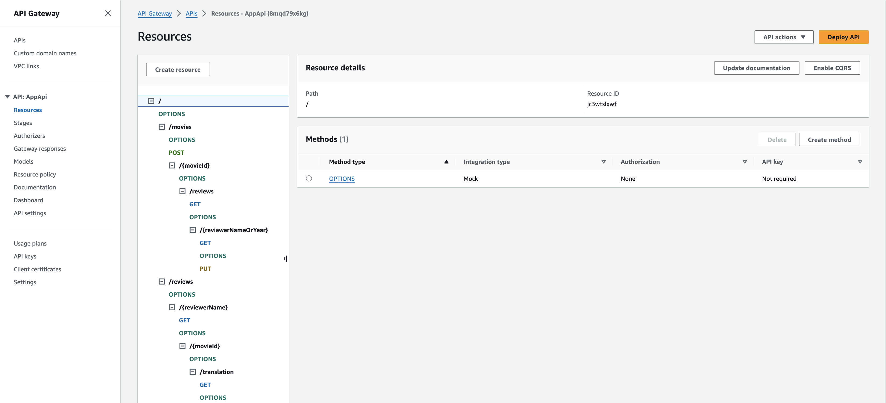
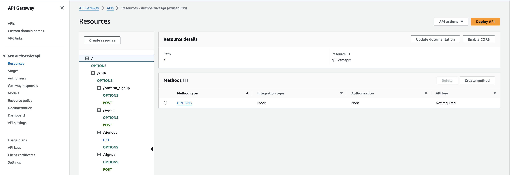
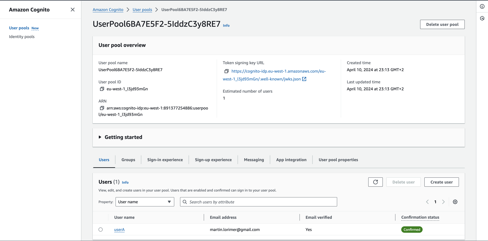

## Serverless REST Assignment.

**Name:** Martin Lorimer

**Video demonstration:** [URL](https://youtu.be/aFDMHSVe0e4)

This repository contains an implementation of a serverless REST API for the AWS platform. The CDK framework is used to provision its infrastructure. The API's domain context is movie reviews.

### API endpoints.

- POST /movies/reviews - add a movie review.
- GET /movies/{movieId}/reviews - Get all the reviews for the specified movie.
- GET /movies/{movieId}/reviews?minRating=n - Get the reviews for the specified movie with a rating greater than the minRating.
- GET /movies/{movieId}/reviews/{reviewerName} - Get the review written by the named reviewer for the specified movie.
- PUT /movies/{movieId}/reviews/{reviewerName} - Update the text of a review.
- GET /movies/{movieId}/reviews/{year} - Get the reviews written in a specific year for a specific movie.
- GET /reviews/{reviewerName} - Get all the reviews written by a specific reviewer.
- GET /reviews/{reviewerName}/{movieId}/translation?language=code - Get a translated version of a movie review using the movie ID and reviewer name as the identifier.

### Authentication.

### Independent learning.

[ Briefly explain any aspects of your submission that required independent research and learning, i.e. typically related to the higher grade bands. State the source files that have evidence of this.

- Lamdbd layers (node modules) - made lambda layers for node modules (see lib/app-api.ts line 77/97)
- Lamdbd layers (custom code) - made lambda layer for some custom code ( see lib/app-api.ts line 70, custom code was httpResponses.ts and parameter layer)
- To deploy the node modules lambda layers I had to use the AWS IDE to deploy/get the linux dependencies for adding to the custom layer
